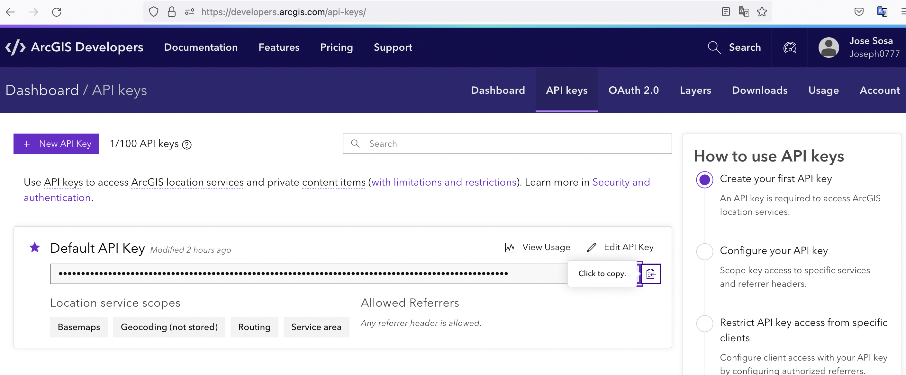

# Display a map

## https://developers.arcgis.com/javascript/latest/display-a-map/

You need to create a developer account in https://developers.arcgis.com/ and then get the API KEY to use it the index.html

